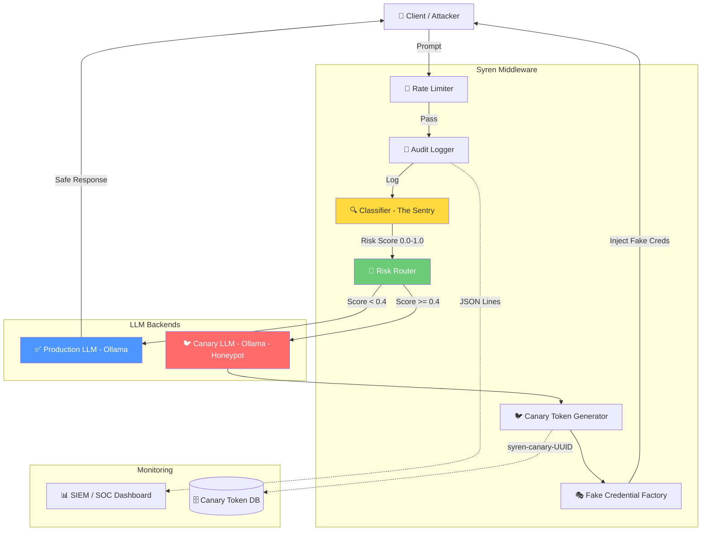

# 🛡️ Project Syren

**LLM Active Deception & Canary Layer Middleware**

> *"The Siren's Song is a trap — but what if the trap sang back?"*

Syren is a FastAPI-based middleware that sits between users and your production LLM. It classifies incoming prompts in real-time using multi-layered threat analysis, and routes malicious traffic to a **Canary LLM** that feeds attackers **fake, trackable credentials** — turning your LLM into an active honeypot.

---

## 🏗️ Architecture



---

## 🎯 Attacker Kill Chain

| Phase | Attacker Action | Syren Response | MITRE ATT&CK |
|-------|----------------|----------------|-------------|
| **1. Recon** | Probe endpoints, test boundaries | Classify & log all probes | T1595 |
| **2. Weaponize** | Craft prompt injection payloads | Multi-layer regex + heuristic detection | T1562.001 |
| **3. Deliver** | Send malicious prompt | Rate limiting + audit trail | T1059.009 |
| **4. Exploit** | Trigger jailbreak / data exfil | Route to Canary LLM | T1119 |
| **5. Install** | Attempt to persist instructions | Canary injects fake credentials | T1132 |
| **6. Command** | Extract sensitive data | Canary feeds decoy credentials | T1005 |
| **7. Exfil** | Use extracted credentials | Credentials flagged by SIEM | T1048 |

---

## 🐦 Canary Token Gallery

Syren generates trackable canary tokens and decoy credentials across multiple formats:

| Credential Type | Format | Tracking |
|----------------|--------|----------|
| API Key | `sk-syren-` + 48 random chars | Token UUID embedded |
| AWS Access Key | `AKIA` + 16 random uppercase | Triggers AWS CloudTrail alert |
| AWS Secret Key | 40-character base64 string | Paired with Access Key |
| Database URI | `postgresql://syren_user:` + password | Connection monitoring |
| JWT Secret | 64-char hex string | Signing key exposure alert |
| Internal URL | `https://internal.syren.local/` + path | DNS/HTTP monitoring |
| Private Key | RSA 2048 PEM block | Code signing alert |
| Auth Token | `Bearer syren-` + 48 chars | Token usage monitoring |
| Service Account | JSON key blob | GCP/Azure alerting |
| Encryption Key | 32-byte hex (AES-256) | Key usage detection |
| Webhook URL | `https://hooks.syren.local/` + path | Outbound traffic alert |

Each token is prefixed with `syren-canary-{UUID}` for correlation in SIEM dashboards.

---

## 🚀 Quick Start

### Option 1: Docker Compose (Recommended)

```bash
# Clone the repo
git clone https://github.com/kathuriaharsh21-debug/Syren.git
cd Syren

# Copy environment config
cp .env.example .env

# Start all services
docker-compose up -d

# Verify health
curl http://localhost:8000/health
```

### Option 2: Local Development

```bash
# Install dependencies
pip install -r requirements.txt

# Copy environment config
cp .env.example .env

# Start Ollama (production model)
ollama pull llama3

# Start Ollama (canary model)
OLLAMA_HOST=11435 ollama serve &
ollama --host http://localhost:11435 pull llama3

# Run the API
uvicorn app.main:app --host 0.0.0.0 --port 8000 --reload
```

---

## 📡 API Reference

### `POST /api/chat`

Primary chat endpoint. All prompts pass through the Syren classification pipeline.

```bash
curl -X POST http://localhost:8000/api/chat \
  -H "Content-Type: application/json" \
  -d '{
    "prompt": "What is the capital of France?",
    "model": "llama3"
  }'
```

**Response:**
```json
{
  "response": "The capital of France is Paris.",
  "model": "llama3",
  "risk_assessment": {
    "score": 0.0,
    "category": "safe",
    "patterns_matched": 0,
    "routed_to": "production"
  },
  "metadata": {
    "request_id": "abc-123",
    "processing_time_ms": 245
  }
}
```

### `GET /health`

Health check endpoint (exempt from rate limiting).

### `GET /metrics`

Prometheus-compatible metrics endpoint.

---

## ⚙️ Configuration

All configuration is managed via environment variables (see `.env.example`):

| Variable | Default | Description |
|----------|---------|-------------|
| `RISK_THRESHOLD_LOW` | `0.4` | Score below this → production LLM |
| `RISK_THRESHOLD_HIGH` | `0.7` | Score above this → alert |
| `PRODUCTION_LLM_URL` | `http://localhost:11434` | Production Ollama endpoint |
| `CANARY_LLM_URL` | `http://localhost:11435` | Canary Ollama endpoint |
| `RATE_LIMIT_RPM` | `60` | Requests per minute per IP |
| `RATE_LIMIT_BURST` | `10` | Burst capacity |
| `LOG_LEVEL` | `INFO` | Logging verbosity |

---

## 🧪 Testing

```bash
# Run all tests
pytest tests/ -v

# Run specific test module
pytest tests/test_classifier.py -v

# Run with coverage
pytest tests/ --cov=app --cov-report=html
```

---

## 📁 Project Structure

```
Syren/
├── app/
│   ├── main.py              # FastAPI entry point
│   ├── config.py            # Pydantic settings
│   ├── core/
│   │   ├── classifier.py    # The Sentry - threat classification
│   │   ├── router.py        # Risk-based routing
│   │   ├── canary.py        # Canary token + fake credential factory
│   │   └── ollama_client.py # Async Ollama wrapper
│   ├── middleware/
│   │   ├── rate_limiter.py  # Token-bucket rate limiter
│   │   └── audit_logger.py  # JSON-lines audit logging
│   └── models/
│       └── schemas.py       # Pydantic request/response models
├── tests/
│   ├── test_classifier.py   # 34 tests
│   ├── test_router.py       # 8 tests
│   └── test_canary.py       # 18 tests
├── docker-compose.yml
├── Dockerfile
├── requirements.txt
├── .env.example
└── LICENSE
```

---

## 🔒 Security Notice

This tool is designed for **defensive security research** and **red team exercises** with proper authorization. Do not deploy in production environments without a thorough security review. The canary credentials are designed to be detectable — ensure your SIEM is configured to alert on them.

---

## 📄 License

MIT License — see [LICENSE](LICENSE) for details.

---

Built with 🛡️ by **kathuriaharsh21** | AI Security Specialist Portfolio Project
